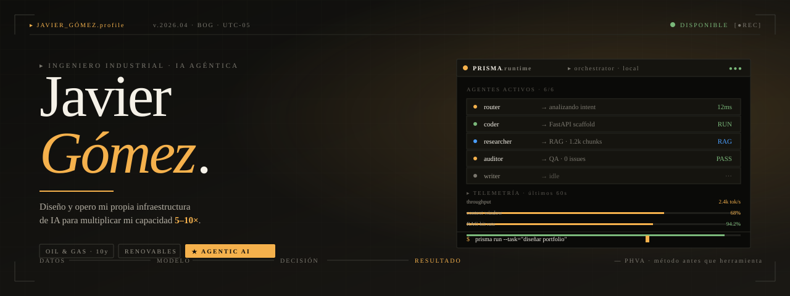
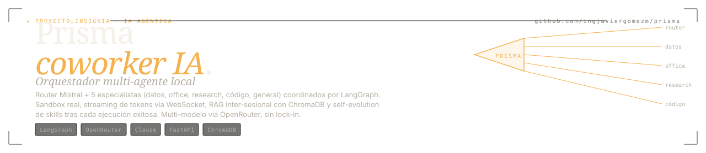
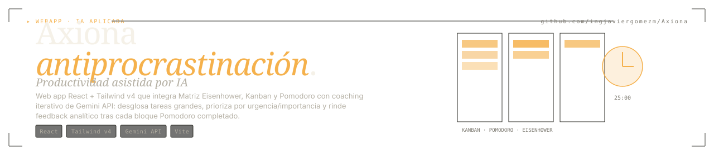
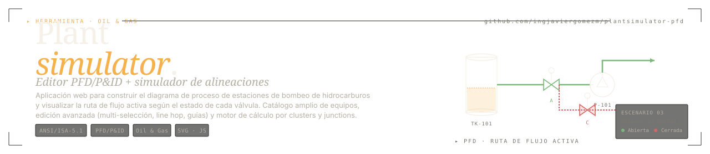
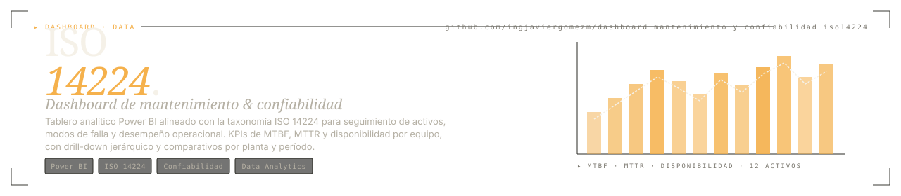
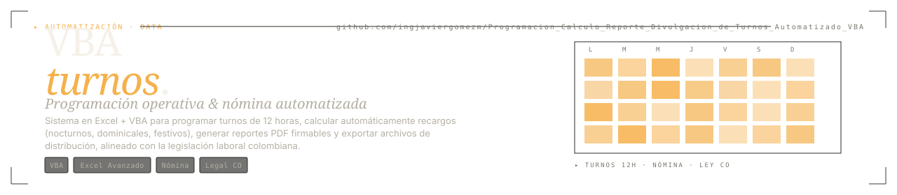

<!--
═══════════════════════════════════════════════════════════════════════════════
  JAVIER GÓMEZ · INGENIERO INDUSTRIAL · OIL & GAS / RENOVABLES / IA AGÉNTICA
  github.com/ingjaviergomezm  ·  v.2026.04
═══════════════════════════════════════════════════════════════════════════════
-->

<a href="https://ingjaviergomezm.github.io/">
  
</a>

<p align="center">
  <a href="https://ingjaviergomezm.github.io/"></a>
  <a href="https://github.com/ingjaviergomezm/prisma"></a>
  <a href="https://www.linkedin.com/in/ingjaviergomezm/"></a>
  <a href="mailto:ingjaviergomez222@gmail.com"></a>
  
</p>

---

## ` 01 ` ── ¿mi propuesta de valor? El Factor 10x

> **No soy solo un ingeniero. Soy un ingeniero con su propia infraestructura de IA.**

He **construido y opero** un ecosistema completo de **Inteligencia Artificial Agéntica** que multiplica mi capacidad de entrega. Mientras otros profesionales trabajan de forma aislada, yo orquesto **agentes especializados** —diseñados, configurados y mantenidos por mí— que ejecutan tareas complejas de forma autónoma: desde generar documentación técnica con branding corporativo hasta auditar arquitecturas de software en tiempo real, pasando por el análisis exploratorio de datos operativos y la entrega de presentaciones ejecutivas listas para sustentar.

El núcleo de este ecosistema es **[Prisma](https://github.com/ingjaviergomezm/prisma)** — un orquestador multi-agente local, propietario, que vive en mi máquina y *ejecuta*. No describe, no sugiere: lee tus archivos con `pandas`, genera Word/Excel/PowerPoint con branding, corre código en sandbox aislado y entrega artefactos verificados, todo bajo el patrón **Plan → Execute → Verify → Iterate** con human-in-the-loop opcional.

### Resultados medibles

| Métrica | Impacto |
|---|---|
| ⏱️ **Tiempo de entrega** | Reducido **5–10×** vs. ejecución manual |
| 📄 **Documentación corporativa** | Reportes, actas y presentaciones en **segundos**, bajo formatos estandarizados y branding corporativo |
| 🛡️ **Aseguramiento de calidad** | Auditoría de seguridad, deuda técnica y cumplimiento mediante **agentes auditores QA automatizados** |
| 🧠 **Curva de aprendizaje** | **Cero re-trabajo:** el sistema recuerda decisiones, contexto y lecciones de cada proyecto |
| 🎼 **RAG & orquestación** | Arquitectura con **memoria a largo plazo** y orquestación multi-agente para contextos de alta complejidad |
| 🔒 **Soberanía del dato** | **100% local** — tus datos no salen de tu máquina; sólo las consultas al LLM viajan, encriptadas, vía OpenRouter |

> 💡 **En términos simples:** cada proyecto que ejecuto se apoya en una maquinaria invisible de agentes que investigan, redactan, auditan y prueban en paralelo. Tú recibes el resultado final con calidad enterprise en una fracción del tiempo.

### 📖 [Conoce Prisma, el orquestador en detalle →](https://github.com/ingjaviergomezm/prisma)

---

## ` 02 ` ── perfil

Ingeniero Industrial con **10+ años de experiencia** en operación, mejora continua y confiabilidad en **Oil & Gas**. Especialista en eficiencia energética, analítica aplicada e **Inteligencia Artificial Agéntica**. Diseño soluciones donde los datos, la automatización avanzada y las decisiones de negocio convergen para generar impacto real y medible.

> *"Si es medible, es mejorable"* — método antes que herramienta.

**Keywords:** `AI/ML` · `Process Automation` · `Data Analytics` · `Agentic AI` · `LLM Orchestration` · `Multi-Agent Systems` · `RAG Systems` · `MCP` · `Python` · `SQL` · `Power BI` · `VBA` · `FastAPI` · `LangGraph` · `ChromaDB` · `ISO 50001` · `ISO 14224` · `Energy Efficiency` · `Oil & Gas Operations` · `Continuous Improvement`

---

## ` 03 ` ── stack (lo que realmente uso)

```text
── IA & AUTOMATIZACIÓN ───────────────────────────────────────────────────────
   LangGraph 1.0 · OpenRouter · Claude · Gemini · Mistral · MCP · RAG (ChromaDB)
   Multi-agent orchestration · Agentic workflows · Self-evolving skills

── DATOS & BI ────────────────────────────────────────────────────────────────
   Power BI · Modelado dimensional · ETL · Python (pandas) · SQL · NumPy

── PRODUCTIVIDAD ─────────────────────────────────────────────────────────────
   VBA / Excel avanzado · FastAPI · React + Vite · Tailwind · Dashboards operativos

── INGENIERÍA ────────────────────────────────────────────────────────────────
   Eficiencia energética · Renovables · Confiabilidad operacional · ISO 50001 · ISO 14224
```

---

## ` 04 ` ── proyectos técnicos destacados

### `▣` IA Agéntica & ecosistemas inteligentes

<a href="https://github.com/ingjaviergomezm/prisma">
  
</a>

> **Prisma — el coworker IA que vive en tu máquina.**
> Orquestador multi-agente propietario corriendo 100% local. Un router Mistral clasifica intenciones y arma el plan, cinco especialistas (datos, office, research, código, general) ejecutan en paralelo bajo LangGraph, y un verificador decide si entregar o iterar. Sandbox real para correr código generado, streaming de tokens vía WebSocket, RAG con ChromaDB sobre tu workspace, y un módulo de aprendizaje que **propone mejoras a las skills** después de cada ejecución exitosa para que tú apruebes con un click. Multi-modelo vía OpenRouter — Claude para razonar, Gemini para research, Mistral para clasificar — sin lock-in.
> **Repo:** https://github.com/ingjaviergomezm/prisma

<a href="https://github.com/ingjaviergomezm/el-camello">
  
</a>

> **El Camello — stack de 16 agentes IA especializados.**
> Arquitectura modular tipo *oficina corporativa de 5 pisos* con un orquestador-PM al mando. Cada agente ejecuta tareas profesionales complejas: generación de documentos con branding, dashboards interactivos, presentaciones ejecutivas, webapps, arte generativo, integraciones MCP. Demuestra dominio práctico de prompting estructurado, diseño modular de agentes y patrones de coordinación. Usado como banco de pruebas para escalar el patrón hacia Prisma.
> **Repo:** https://github.com/ingjaviergomezm/el-camello
> **Demo:** https://ingjaviergomezm.github.io/el-camello/

<a href="https://github.com/ingjaviergomezm/Axiona">
  
</a>

> **Axiona — ecosistema antiprocrastinación potenciado por IA.**
> Aplicación web interactiva (React + Tailwind v4) diseñada para productividad de alto rendimiento. Integra metodologías ágiles —**Matriz Eisenhower**, **Kanban**, **Pomodoro**— con **Gemini API** para el desglose automático de tareas grandes en sub-tareas accionables, priorización por urgencia/importancia y coaching analítico iterativo después de cada bloque Pomodoro. Demuestra desarrollo de UI/UX modernos, gestión de estado global, llamadas API tipadas y diseño centrado en hábitos.
> **Repo:** https://github.com/ingjaviergomezm/Axiona
> **Demo:** https://ingjaviergomezm.github.io/Axiona/

<a href="https://github.com/ingjaviergomezm/phva-vectorizado">
  
</a>

> **Memoria PHVA Vectorizada — framework de resiliencia agéntica.**
> Manifiesto técnico + skill operativa que implementa el ciclo Plan-Hacer-Verificar-Actuar con **persistencia vectorial asíncrona**. Resuelve la "amnesia estructural" en agentes LLM mediante destilación de lecciones aprendidas a partir de logs históricos, indexadas como embeddings consultables. Resultado: mitigación proactiva de errores conocidos, optimización drástica del consumo de tokens y evolución inter-sesional del comportamiento del agente.
> **Repo:** https://github.com/ingjaviergomezm/phva-vectorizado

---

### `◈` Energía, operaciones & eficiencia

<a href="https://github.com/ingjaviergomezm/solar-project-planner">
  
</a>

> **Solar Project Planner — planificador técnico-financiero con IA.**
> Aplicación web para la evaluación técnica, económica y financiera de sistemas fotovoltaicos en el mercado colombiano. Modela dimensionamiento, generación esperada (PVGIS), TIR, payback y autoconsumo bajo los supuestos normativos locales (Ley 1715 de incentivos, esquema tarifario CREG). Incorpora un módulo de IA para recomendaciones de configuración basadas en perfil de carga del cliente.
> **Repo:** https://github.com/ingjaviergomezm/solar-project-planner
> **Demo:** https://solar-project-planner.vercel.app/

<a href="https://github.com/ingjaviergomezm/autodiagnostico-eficiencia-energetica">
  
</a>

> **Autodiagnóstico interactivo de eficiencia energética (ISO 50001).**
> Herramienta web orientada a procesos industriales para que las organizaciones evalúen su nivel de madurez en gestión energética alineada con los requisitos de la norma ISO 50001. Cuestionario por dominios (política, planificación, operación, verificación, mejora), scoring ponderado y entrega de un *roadmap accionable* alineado con el ciclo PHVA de la norma.
> **Repo:** https://github.com/ingjaviergomezm/autodiagnostico-eficiencia-energetica
> **Demo:** https://ingjaviergomezm.github.io/autodiagnostico-eficiencia-energetica/

<a href="https://github.com/ingjaviergomezm/plantsimulator-pfd">
  
</a>

> **PlantSimulator — editor de PFD/P&ID + simulador de alineaciones operativas.**
> Aplicación web para construir el diagrama de proceso de estaciones de bombeo de hidrocarburos y visualizar la ruta de flujo activa según el estado normal de cada válvula/bomba. Catálogo amplio de equipos (tanques, vasijas, separadores, trampas de raspadores, sumideros con arreglo típico, mezcladores estáticos, LACT, fronteras, válvulas HV/MOV/PCV…), servicios de tubería con código de color, edición avanzada (multi-selección Ctrl+click, arrastre por tramos manteniendo ortogonalidad, guías de alineación, *line hop* automático en cruces) y motor de cálculo de ruta de flujo (clusters, terminales, bloqueos, junctions virtuales). Cumple con simbología **ANSI/ISA-5.1 (2024)**. Demo público sin datos reales; código fuente privado.
> **Repo (showcase + manual):** https://github.com/ingjaviergomezm/plantsimulator-pfd
> **Demo en vivo:** https://tubular-licorice-aa8ef2.netlify.app/

---

### `▤` Data Analytics & automatización

<a href="https://github.com/ingjaviergomezm/dashboard_mantenimiento_y_confiabilidad_iso14224">
  
</a>

> **Power BI — Dashboard de mantenimiento y confiabilidad (ISO 14224).**
> Tablero analítico end-to-end alineado con la taxonomía y principios de la norma ISO 14224 para la industria de procesos. Seguimiento de activos, modos de falla y desempeño operacional con KPIs de **MTBF**, **MTTR** y **disponibilidad** por equipo y nivel jerárquico. Drill-down desde planta → unidad → equipo → componente, comparativos por período y alertas configurables sobre desviaciones críticas.
> **Repo:** https://github.com/ingjaviergomezm/dashboard_mantenimiento_y_confiabilidad_iso14224

<a href="https://github.com/ingjaviergomezm/Programacion_Calculo_Reporte_Divulgacion_de_Turnos_Automatizado_VBA">
  
</a>

> **Excel + VBA — Automatización de programación de turnos y reporte de nómina.**
> Sistema completo en Excel + VBA para programación operativa de turnos de 12 horas, cálculo automático de novedades de nómina (recargos nocturnos, dominicales, festivos), análisis comparativo por trabajador (heatmap), KPIs legales y generación segura de reportes PDF firmables y archivos de distribución, alineado con la legislación laboral colombiana. Caso de uso real en supervisión operativa Oil & Gas.
> **Repo:** https://github.com/ingjaviergomezm/Programacion_Calculo_Reporte_Divulgacion_de_Turnos_Automatizado_VBA

---

## ` 05 ` ── manifiesto

```text
01  Si es medible, es mejorable.
02  Método antes que herramienta — el LLM cambia, el rigor permanece.
03  Agentes, no asistentes — código que ejecuta, no texto que sugiere.
04  El contexto es el activo — RAG persistente, memoria inter-sesional.
05  Soberanía del dato — local first, sin lock-in.
```

---

## ` 06 ` ── actividad

<table>
<tr>
<td width="58%" valign="top">


</td>
<td width="42%" valign="top">


</td>
</tr>
</table>


<a href="https://github.com/ryo-ma/github-profile-trophy">
  
</a>

---

## ` 07 ` ── colaboración

**¿Un reto de IA agéntica, datos o energía?**
Disponible para proyectos donde el método importa más que el modelo —y donde se mide el impacto, no el esfuerzo. Cada caso se discute, se mide y se documenta bajo la cadena completa **problema → datos → modelo → decisión → resultado**.

<p>
  <a href="https://ingjaviergomezm.github.io/"></a>
  <a href="mailto:ingjaviergomez222@gmail.com"></a>
  <a href="https://www.linkedin.com/in/ingjaviergomezm/"></a>
</p>

<sub>
<code>© 2026 Javier Gómez · Colombia · UTC-05</code> &nbsp;·&nbsp;
<code>diseñado para iterar</code> &nbsp;·&nbsp;
<i>"Si es medible, es mejorable"</i>
</sub>
