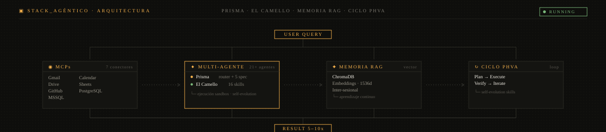
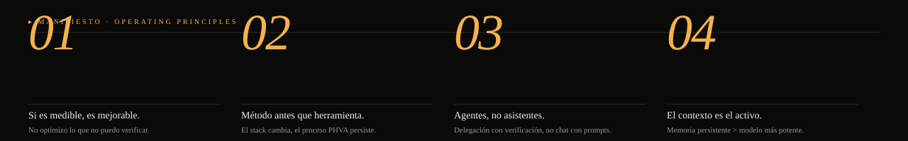
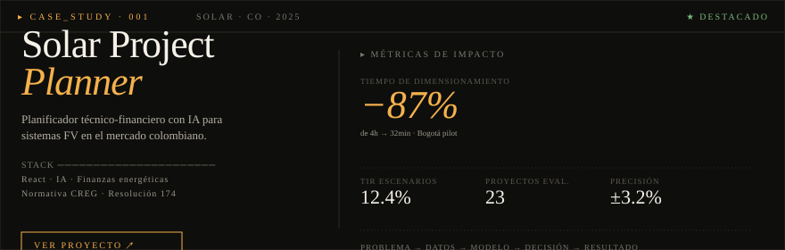

<!--
═══════════════════════════════════════════════════════════════════════════════
  JAVIER GÓMEZ · INGENIERO INDUSTRIAL · OIL & GAS / RENOVABLES / IA AGÉNTICA
  github.com/ingjaviergomezm  ·  v.2026.04
═══════════════════════════════════════════════════════════════════════════════
-->

<a href="https://ingjaviergomezm.github.io/">
  
</a>

<p>
  <a href="https://ingjaviergomezm.github.io/"></a>
  <a href="https://www.linkedin.com/in/ingjaviergomezm/"></a>
  <a href="mailto:ingjaviergomez222@gmail.com"></a>
  
</p>

---

## ` 01 ` ── propuesta de valor

> No soy solo un ingeniero. Soy un ingeniero con su **propia infraestructura de IA**.
> Diseñé y opero [**Prisma**](https://github.com/ingjaviergomezm/prisma) — un orquestador multi-agente local
> que ejecuta tareas complejas de forma autónoma mientras yo me concentro en las decisiones.

| ` 01 ` Tiempo | ` 02 ` Documentación | ` 03 ` QA | ` 04 ` Curva |
|:---|:---|:---|:---|
| **5–10x** | **segundos** | **auto** | **0** |
| <sub>vs. ejecución manual</sub> | <sub>branding corporativo</sub> | <sub>agentes auditores</sub> | <sub>memoria RAG persistente</sub> |



---

## ` 02 ` ── manifiesto



---

## ` 03 ` ── caso destacado



> Cada caso documenta la cadena completa **problema → datos → modelo → decisión → resultado**.
> Más en el [portafolio](https://ingjaviergomezm.github.io/).

---

## ` 04 ` ── proyectos seleccionados

### `▣` IA Agéntica

<table>
<tr>
<td width="50%" valign="top">

#### [Prisma](https://github.com/ingjaviergomezm/prisma) `★`
**Orquestador multi-agente local**

Router + 5 especialistas. Sandbox real, RAG inter-sesional, PHVA con self-evolution.

`LangGraph` `Claude` `OpenRouter` `ChromaDB`

</td>
<td width="50%" valign="top">

#### [El Camello](https://ingjaviergomezm.github.io/el-camello/) `★`
**Stack de 16 agentes especializados**

Oficina corporativa de 5 pisos: docs, dashboards, presentaciones, webapps.

`Multi-agent` `Python` `MCP` `FastAPI`

</td>
</tr>
<tr>
<td width="50%" valign="top">

#### [Axiona](https://ingjaviergomezm.github.io/Axiona/)
**Antiprocrastinación con IA**

Eisenhower + Kanban + Pomodoro con coaching iterativo.

`React` `Tailwind v4` `Gemini API`

</td>
<td width="50%" valign="top">

#### [PHVA Vectorizado](https://github.com/ingjaviergomezm/phva-vectorizado)
**Resiliencia agéntica**

Resuelve la amnesia estructural en LLM con persistencia vectorial.

`Vector DB` `AI Resilience`

</td>
</tr>
</table>

### `◈` Energía & Renovables · `▤` Data & Automatización

<table>
<tr>
<td width="50%" valign="top">

#### [Solar Project Planner](https://solar-project-planner.vercel.app/) `★`
Planificador técnico-financiero FV — mercado CO.

`Energía Solar` `Finanzas` `IA`

</td>
<td width="50%" valign="top">

#### [Autodiagnóstico ISO 50001](https://ingjaviergomezm.github.io/autodiagnostico-eficiencia-energetica/)
Madurez en gestión energética industrial.

`ISO 50001`

</td>
</tr>
<tr>
<td width="50%" valign="top">

#### [Dashboard ISO 14224](https://github.com/ingjaviergomezm/dashboard_mantenimiento_y_confiabilidad_iso14224)
Mantenimiento & confiabilidad en Power BI.

`Power BI` `ISO 14224`

</td>
<td width="50%" valign="top">

#### [Automatización VBA](https://github.com/ingjaviergomezm/Programacion_Calculo_Reporte_Divulgacion_de_Turnos_Automatizado_VBA)
Programación de turnos & nómina.

`VBA` `Excel`

</td>
</tr>
</table>

---

## ` 05 ` ── stack

```text
── IA & AUTOMATIZACIÓN ───────────────────────────────────────────────────
   LangGraph · OpenRouter · Claude · Gemini · MCP · RAG (ChromaDB)
   Multi-agent orchestration · Agentic workflows

── DATOS & BI ────────────────────────────────────────────────────────────
   Power BI · Modelado dimensional · ETL · Python (pandas) · SQL

── PRODUCTIVIDAD ─────────────────────────────────────────────────────────
   VBA / Excel · FastAPI · React + Vite · Dashboards operativos

── INGENIERÍA ────────────────────────────────────────────────────────────
   Eficiencia energética · Renovables · Confiabilidad · ISO 50001 · 14224
```

---

## ` 06 ` ── actividad

<table>
<tr>
<td width="58%" valign="top">


</td>
<td width="42%" valign="top">


</td>
</tr>
</table>

<picture>
  <source media="(prefers-color-scheme: dark)" srcset="https://raw.githubusercontent.com/ingjaviergomezm/ingjaviergomezm/output/snake-dark.svg" />
  
</picture>


<a href="https://github.com/ryo-ma/github-profile-trophy">
  
</a>

---

## ` 07 ` ── colaboración

**¿Un reto de IA agéntica, datos o energía?**
Disponible para proyectos donde el método importa más que el modelo.
Cada caso se discute, se mide y se documenta.

<p>
  <a href="https://ingjaviergomezm.github.io/"></a>
  <a href="mailto:ingjaviergomez222@gmail.com"></a>
</p>

<sub>
<code>© 2026 Javier Gómez · Colombia · UTC-05</code> &nbsp;·&nbsp;
<code>diseñado para iterar</code> &nbsp;·&nbsp;
<i>"Si es medible, es mejorable"</i>
</sub>
